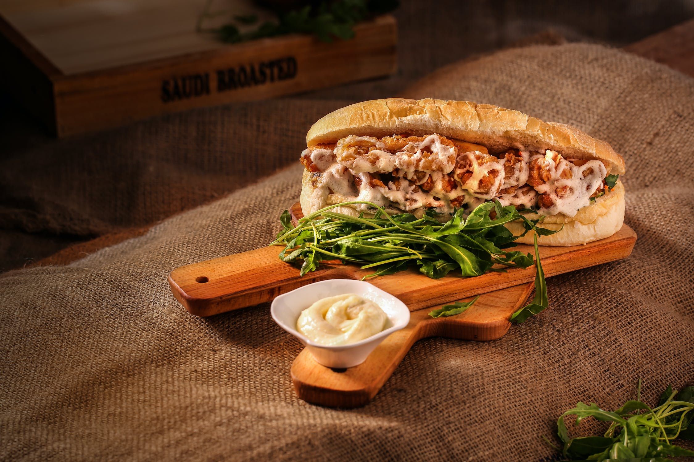

There's constant debate about the definition of sandwiches. Questions around hot dogs, tacos, sushi, etc. are all valid, but I've come to believe that based on most people's definition of what makes a sandwich, everything is probably a sandwich<!-- more -->.

# Evidence: Types of Sandwiches
There's a lot of sandwiches out there. PoBoys and Meatball subs have always been kind of a weird bread taco, open face sandwiches a kind of a bad pizza. What classifies these foods as sandwiches, in my opinion, isn't their resemblance to "normal" or "good" sandwiches, but rather their state as obviously bad sandwiches.

Is a po-boy cut through a sandwich?

Subs can be made into traditional sandwiches easily by cutting the bread all the way through. Open face sandwiches can be resolved by folding, combining two of them, adding a slice of bread, or dividing and re-assembling.

If you drop one avocado toast onto another, is that a sandwich?
With cuisine constantly pushing the envelope worldwide, we run into weird hybrids—ramen buns, rice buns, sushi sandwiches, waffle burgers, tortas, even sandwiches with other sandwiches for bread. The variety of things that people will use to sandwich things is amazing.

# Evidence: Slicing

Most people will agree that a club sandwich is a sandwich. The definition gets a little murky with slicing, though. If you have a sandwich, but cut it in half, is each half of a sandwich a sandwich itself? Part of the problem has to do with intent. While half a sandwich might seem like less than a sandwich, someone who took one piece of bread, cut it in half and used it to make a smaller sandwich still made a sandwich. My college cafeteria sold pre-wrapped sandwich halves.

[sandwich](../img/sandwich)

Is this four sandwiches if four people eat it?
Here, with a sandwich cut into four, we have a harder time deciding if each part is a sandwich. Most of us recognize that at some point, if we sliced small enough, we'd stop having a sandwich, but few people are comfortable defining that point exactly. It's a similar question to "How many grains of sand make a pile?" How small of a sandwich is still a sandwich?

If this sandwich were cut into four, would they each be a sandwich?

# Evidence: Definition

Sandwich, while often focused on as a noun, is also a verb.

to have a layer of a different substance on either side

The main sticking point here is "side." If you have a burrito, the cylinder only has two sides: inside and outside, unless you cut it through.

If you cut a burrito lengthwise, is it a sandwich?

# Evidence: Quality

The major thing I'll call out here is that my argument has nothing to do with whether something is a "good" sandwich. Tacos, hot dogs, open faced, sushi, they're all bad sandwiches, but they're all still sandwiches based on the definition.

# Conclusion

If we take all of these ideas and combine them, we realize that, by definition, many things are just really bad sandwiches. Trees? Just bark around heartwood. Cars? Metal shell with people inside. They're all terrible sandwiches.

What makes things interesting is that if you cut a sandwich small enough, it'll be two bread molecules around one meat molecule. Even at that scale, you can go smaller. Isn't water just a bad sandwich of hydrogen and oxygen atoms? The problem I see is that it's impossible to know exactly where in the molecule the atoms are at any given time. They're likely to be where we expect them to be, but at quantum levels, we're dealing more with probabilities than certainties.

Hence, everything is a sandwich. Probably.