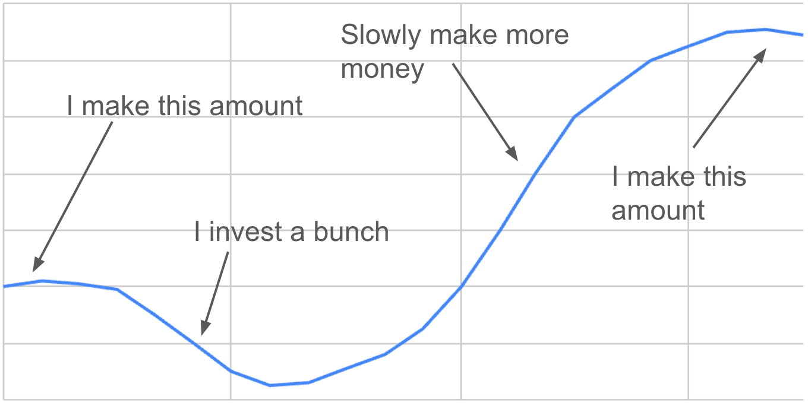
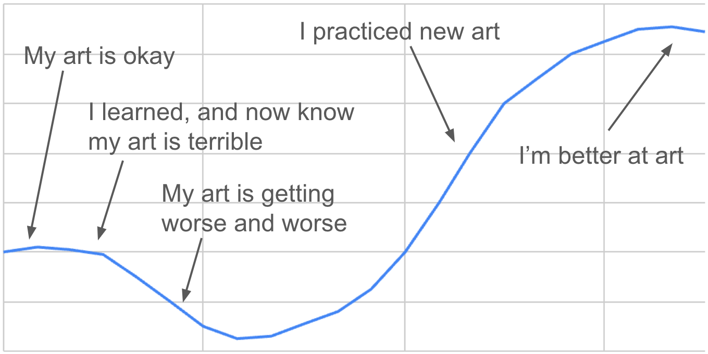
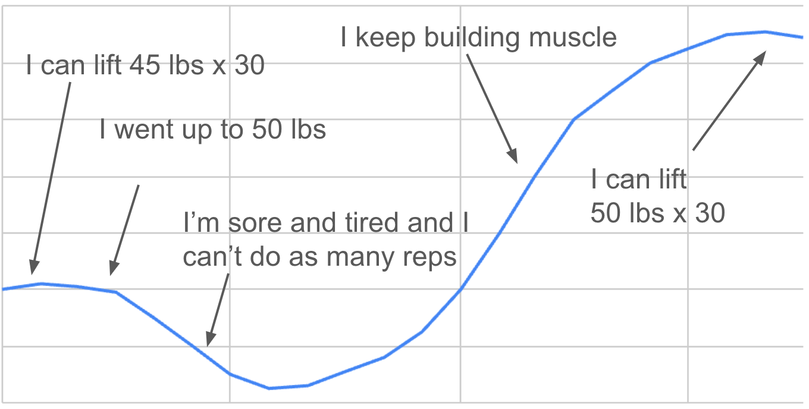

I recently read a [Mandy Musing](https://mandymusings.com/?ref=morganengel.com) called, "[Why aren't you doing better](https://mandymusings.com/posts/why-arent-you-doing-better?ref=morganengel.com)" and one of the parts I focused on was a lesson I learned from starting and running businesses. Growth in business follows a j-curve. This is widely known, but I've come to realize that growth of any kind follows similar patterns<!-- more -->.

How investing affects short-term business cash flow

J-Curves traditionally begin with a plateau, then a drop due to investment, then growth beyond the plateau, eventually settling to a higher plateau.

I first encountered this as a business when switching from selling other people's products to manufacturing our own. We designed a pickleball paddle and made prototypes, but we knew we'd have to spend a bunch of time, money, and advertising on getting our new product out there. The graph above is an approximation of our profit dropping due to our investment then the predicted return on that investment.

I first noticed the correlation of business investment to personal investment when learning how to do art.

To be clear, this chart is less about the quality of my art, and more about my estimation of my art. As I get better, my ability to differentiate good and bad is the first thing to improve. This means that art I would have previously considered great is now terrible compared to what I want to make.

How it feels to learn art

This is also how I experience weight lifting. When I'm able to do the exercise easily, I increase the weight, which makes me tired and sore, and I fail more often and more easily, which leads to me feeling like a failure.

I find that this chart applies to many more situations than I previously expected including:

*   Losing weight

*   Starting a hobby

*   Starting a new job

*   Having an argument / gaining shared understanding

*   College classes

*   Pruning fruiting plants

*   Adoption of a new technology

I've started seeing this so often that I wonder if this approach should be considered obvious for most cases in which things can grow. I often tell newly hired engineers on my teams that it'll be three months before they're comfortable, and the pattern follows a pretty easy J-curve.