Charlie had a lot of fun running to and away from Roscoe.

He's a nervous about all that dog coming at him for kisses, but first thing in the morning he tried to go directly from bed to share his writing board with "Wosco"<!-- more -->.

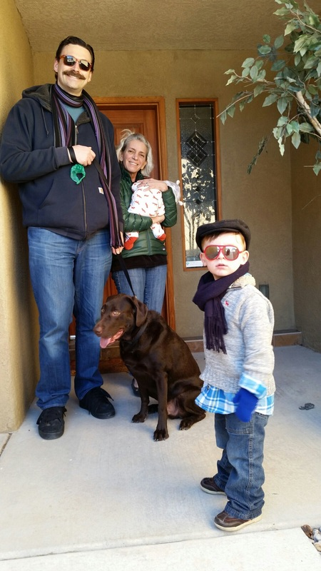
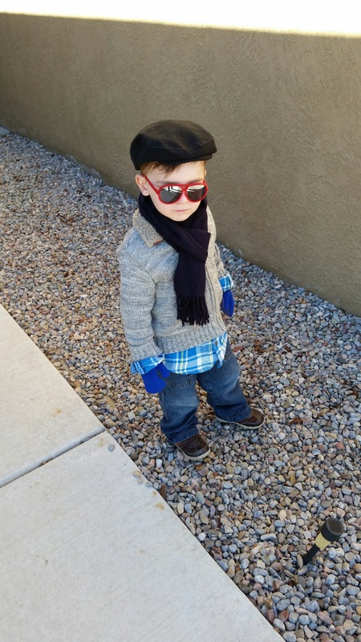
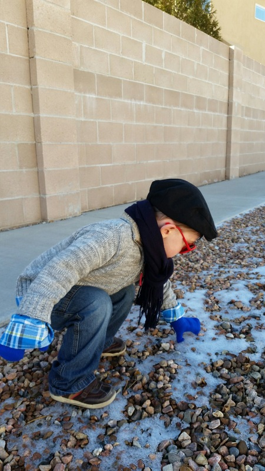
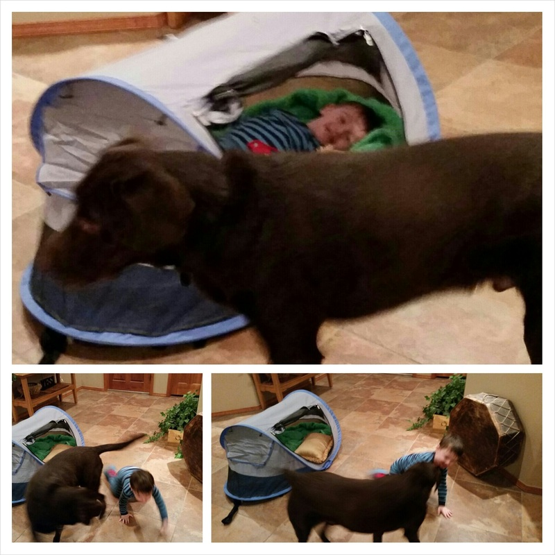
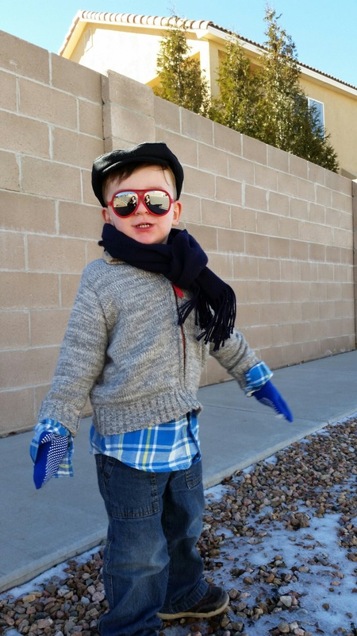
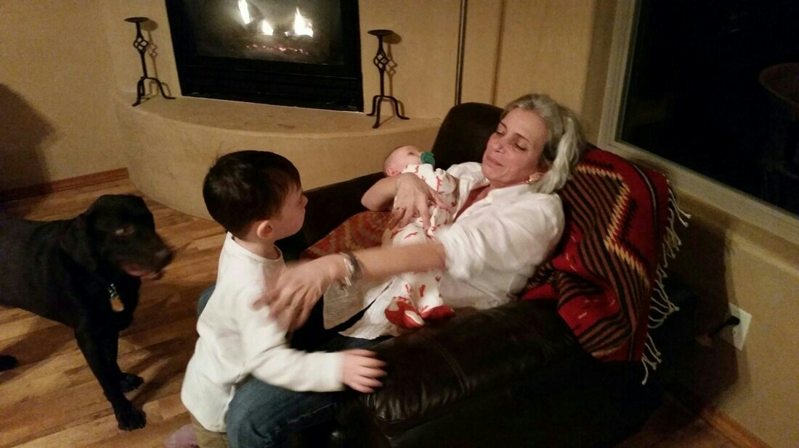

Later a few of us went on a nice long walk near the petroglyphs, and saw a bunch of hot air balloons rising up into the air. Charlie got to poke at some snow which he'd never seen before outside of books.

The ladies and Malcolm went shopping while the men stayed home to drink beer and watch football. Charlie napped which was just as good. Probably.

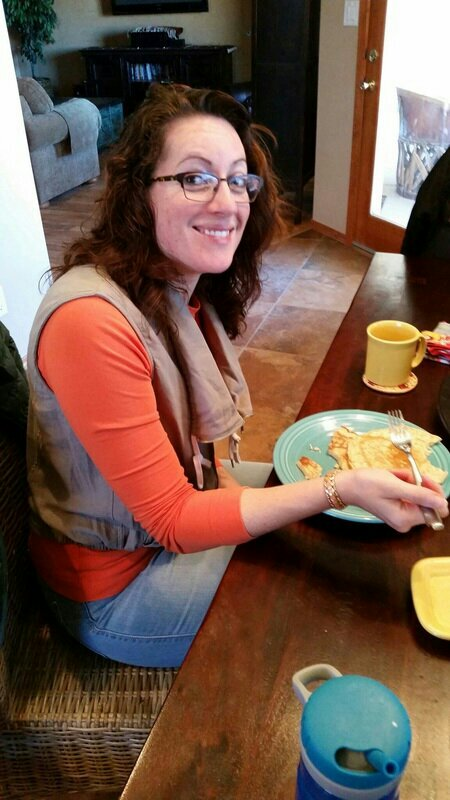
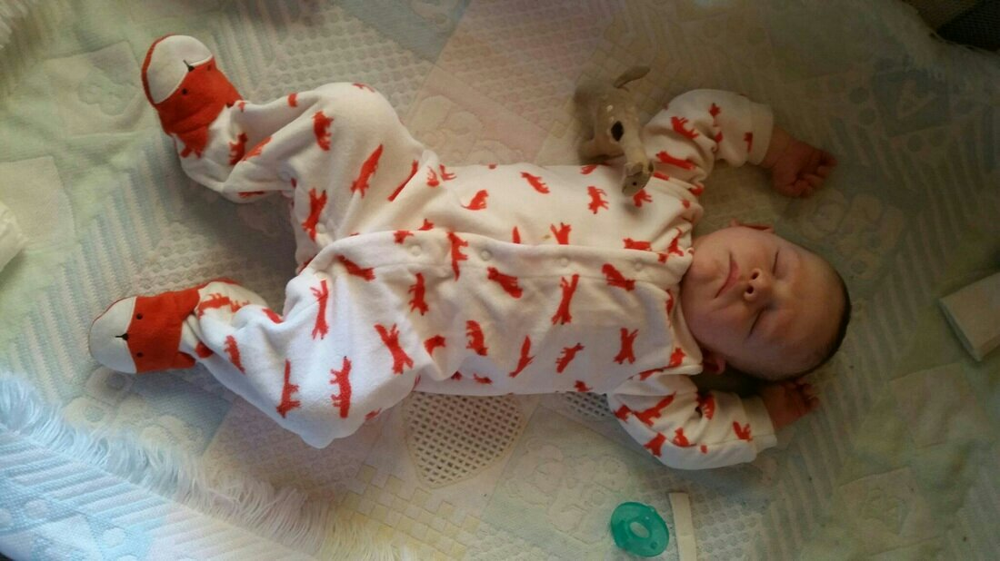
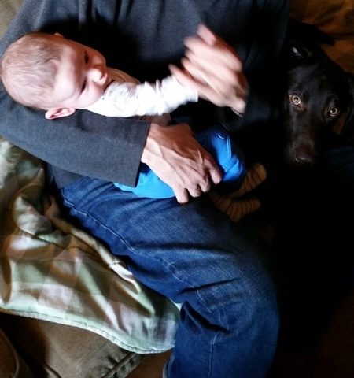
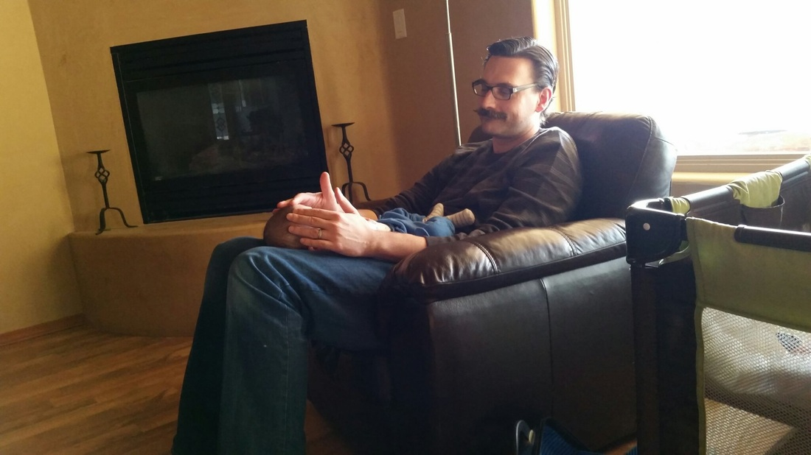
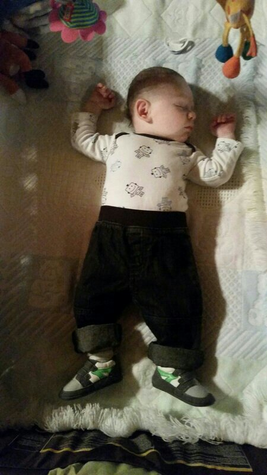
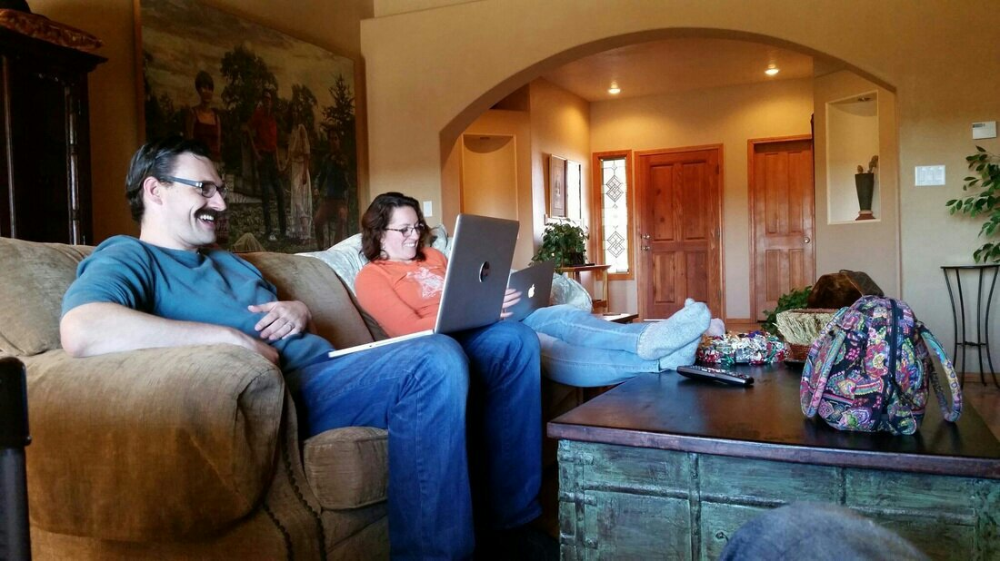
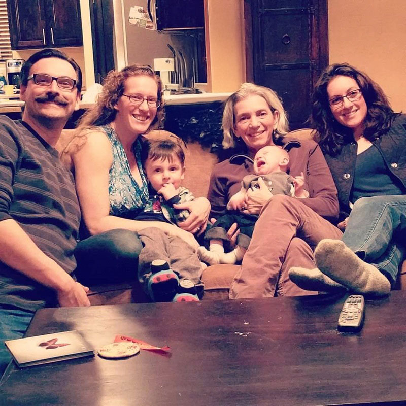

After many more hugs and kisses - like an hour more , we are now on our way to AZ to see the next set of grandparents!
Goodbye Grandmama and Grandpapa! Hello Grandma Gale  and Grandpapa Richard! We'll see you soon (ish)!

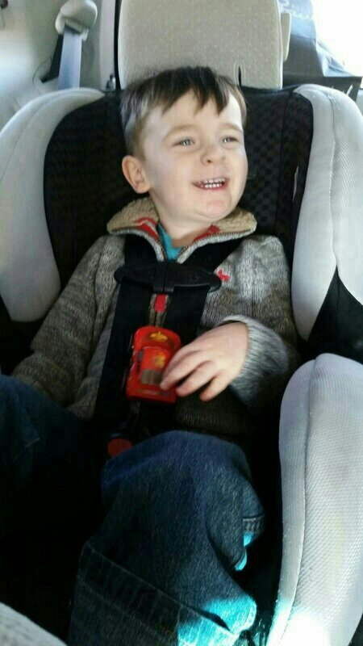
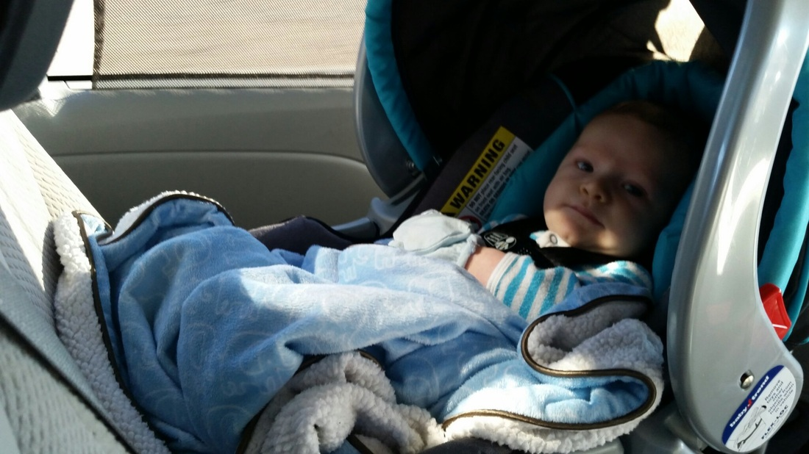

