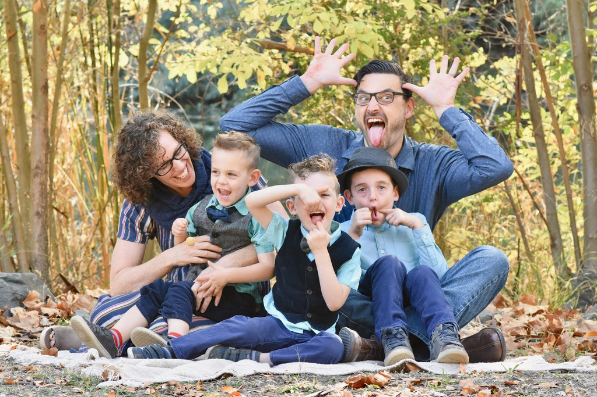

I’m writing to you from a desk in my house that has fruit snack wrappers, hand-made cards from my kids, and more empty yerba mate cans than I care to admit. When my camera faces one direction, I only need to clean one direction. When my priorities shift, things like organization and slack in my schedule are often the first to go<!-- more -->.

We have three boys, Henry (preschool), Malcolm (kindergarten), and Charlie (2nd grade), and they keep us busy! Charlie is diagnosed with Autism Spectrum Disorder and has been doing Advanced Behavioral therapy 4 days a week for 2 years. Malcolm is deaf and has bilateral cochlear implants, and has speech therapy three times a week. Henry is likely on the autism spectrum, though undiagnosed.

My wife was/is a teacher of circus acrobatics at a variety of schools in the East SF Bay Area, usually focusing on teaching children. I’ve been programming for over 20 years and have 2.5 years as an engineering manager at Square. My children’s school is on hold, my wife’s career is on hold, our trips, our family, our friends, all on hold. Our therapy sessions and visits with grandma are all over video chat.

Everything seems different, and I’m trying to remember to focus less on what was and what will be, and instead to try to remember that life happens whether you’re ready or not, and to make the most of where I am now.

I’ve never spent so much time with my kids. With my commute gone, I see them at breakfast and dinner every day. When working from home, I spend lunch with them. I’m around in the evenings because I can’t go visit people. The sheer volume of quality time is overwhelming, and when quarantine is over, I may never get this amount of time with them again. It’s amazing to see them grow so gradually, when before it felt like I got weekly snapshots. With all of that background, you’ll understand why my wife and I have spent a bunch of time finding quarantine activities. We’ll list some of our winners at the bottom. We’ve watched some classics as a family (currently Avatar: The Last Airbender), and I’ve been reading Lord of the Rings to my oldest at night. For all of our work and time spent, routine remains one of the most difficult things to keep. Some days are easy and the kids run their own schedules, some days we fight them at every turn. Some days we keep to the schedule, some days we don’t care if everything slips. The weird combination of stir crazy and social isolation wears on me more than my wife, but we’re all feeling it. I feel lucky that my kids have brothers. I was an only child and this would have been terrible for me.

The last thing I’ll talk about is how we keep ourselves happy during tough times. For years, my wife and I have been trading one night off a week. She tends to do craft projects like sewing outfits for the kids, and I play games with friends over the internet. In the absence of date nights, having a night with no responsibilities is such a luxury. I’ve just put my wife’s first and second vacation on the calendar since she’s been watching the kids for four months straight.

**Excavation!**
Get some small toys. New, old, doesn’t matter. Bath toys work great. Put some water or milk and food coloring into a tupperware. Add the toy and put it in the freezer. When it’s solid, give it to the kids to slowly melt and chip away at the block of ice.

**Kitchen Science!**
Many of the chemicals in your pantry can be used to teach chemistry. Acids like vinegar, lemon juice, cream of tartar, or citric acid can be combined with bases like milk and baking soda. Write down your guesses and your findings. Bonus substance is baking powder -- a mix of both acid and base.
Bonus points to learn about how acids and bases interact and why the result is salty.
Extra bonus points if you make farmhouse cheese from vinegar + raw milk.

**Crafting!**
Shaving cream + food coloring = bathtub paint
Tempera paint sticks are amazing. We ask our kids to paint rocks for us and add them to a pile of colorful rocks or leave them around the neighborhood when we go on walks.
Kids love tape. Letting kids go crazy with the Amazon box and tape has been fun.

